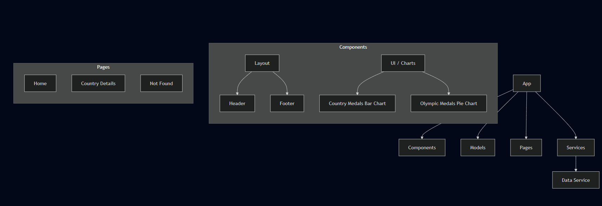

# Front-End Architecture – TéléSport Project

This document describes the new front-end architecture of the TéléSport project.  
It is designed so that a new developer can quickly understand the structure and the responsibilities of each component.

---

## **1. Folder Structure**

## **2. Components and Their Roles**

| Component / Folder | Role / Description |
|--------------------|--------------------|
| components/layout/header/ | Displays the global application header. |
| components/layout/footer/ | Displays the global footer. |
| components/ui/charts/country-medals-bar-chart/ | Component used to display medals by country. |
| components/ui/charts/olympic-medals-pie-chart/ | Component used to display total medals in a chart. |
| pages/home/ | The application’s home page. |
| pages/country-details/ | Page that displays detailed medal information by country. |
| pages/not-found/ | Page used to handle non-existing routes. |

---

## **3. Angular Service**

| Service | Role |
|---------|------|
| services/data.service.ts | Centralizes all API calls, provides data to components, and manages observables. |

---

## **4. Advantages**

- Clear separation of responsibilities (UI components vs business logic)  
- Ready for future backend/API integration  
- Improves unit testing and overall extensibility  
