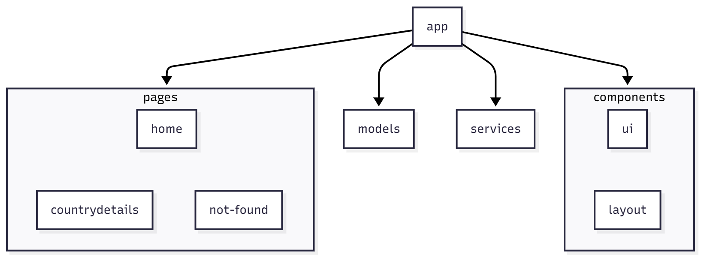

# Analyse et Refactorisation - Projet TéléSport

---

## **1. Problèmes Identifiés dans le Starter Code**

### **1.1. Mauvaises Pratiques Angular**

| Type de Problème          | Description                                                                                     | Exemple (Fichier/Ligne)                     |
|----------------------------|-------------------------------------------------------------------------------------------------|--------------------------------------------|
| **Appels HTTP dans les composants** | Les appels API sont effectués directement dans les composants au lieu d'être centralisés dans un service. | `country-details.component.ts` |
| **Absence de typage strict** | Utilisation de `any` au lieu de types spécifiques.                                              | `home.component.ts`           |
| **Code dupliqué**          | La logique de calcul des totaux est dupliquée dans plusieurs composants.                     | `country.component.ts`  |
| **Fichiers trop volumineux** | Certains fichiers contiennent trop de responsabilités (affichage + logique métier).          | `dashboard.component.ts`                  |
| **Code obsolète**          | Présence de `console.log` inutiles et de code commenté.                                         | `country.component.ts`  |
| **Mauvaise gestion des observables** | Les observables ne sont pas correctement gérés (pas de `pipe`, pas de `async`).              | `home.component.ts`         |
| **Mauvaise arborescence des fichiers** | La structure actuelle est peu compréhensible et difficilement maintenable.           | `components/data.service.ts`              |

### **1.2. Risques de Dette Technique**
- **Maintenabilité** : Difficile de maintenir le code à cause de la duplication et du manque de structure.
- **Évolutivité** : Ajouter de nouvelles fonctionnalités sera complexe sans une architecture claire.
- **Tests** : Le code n'est pas facilement testable à cause du mélange des responsabilités.

---

## **2. Nouvelle Architecture Proposée**

### **2.1. Arborescence Cible**

### **2.2. Rôles et Responsabilités**

| Dossier               | Rôle                                                                                     | Exemple de Contenu                          |
|-----------------------|------------------------------------------------------------------------------------------|---------------------------------------------|
| `components/ui/charts/` | Composants réutilisables pour les graphiques.                                            | `OlympicMedalsPieChartComponent`            |
| `components/layout/`  | Composants de mise en page.                                                              | `HeaderComponent`                           |
| `models/`             | Interfaces TypeScript pour le typage des données.                                        | `Olympic`, `Participation`                 |
| `pages/`              | Pages principales de l'application.                                                       | `HomeComponent`, `CountryDetailsComponent` |
| `services/`           | Services pour les appels API et la logique métier.                                       | `DataService`                              |

### **2.3. Design Patterns à Appliquer**

| Pattern               | Application                                                                               | Avantages                                                                 |
|------------------------|------------------------------------------------------------------------------------------|---------------------------------------------------------------------------|
| **Singleton**          | `DataService` est fourni au niveau racine (`providedIn: 'root'`).                      | Une seule instance du service dans toute l'application.                |
| **Séparation des responsabilités** | Composants pour l'affichage, services pour la logique métier.                          | Code plus maintenable et testable.                                       |

### **2.4. Améliorations à Apporter**
- **Centralisation des appels API** : Tous les appels HTTP sont déplacés dans `DataService`.
- **Typage strict** : Utilisation d'interfaces TypeScript pour éviter `any`.
- **Composants réutilisables** : Les graphiques et le header sont des composants standalone.
- **Gestion des observables** : Utilisation correcte de `pipe` et `async` pour les données réactives.
- **Structure claire** : Dossiers organisés par fonctionnalité.

### **2.5. Facilitation pour l'Intégration d'un Backend**
- **Services comme points de contact** : `DataService` sera le seul point à modifier pour connecter une API réelle.
- **Interfaces TypeScript** : Les modèles (`Olympic`, `Participation`) facilitent l'intégration des données de l'API.
- **Observables** : La gestion réactive des données est déjà en place pour une intégration fluide.

---

## **3. Étapes de Refactorisation**

### **3.1. Séparation des Composants**
- Création du composant `country-medals-bar-chart` pour afficher les médailles par pays.
- Création du composant `medals-pie-chart` pour l'affichage total.
- Cela permet de rendre le composant `country` plus léger et mieux structuré.

### **3.2. Suppression du Code Obsolète**
- Supprimer les `console.log` inutiles.
- Supprimer le code commenté obsolète.
